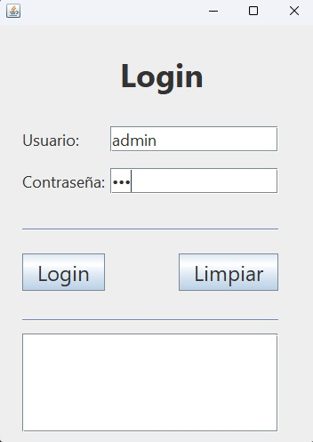
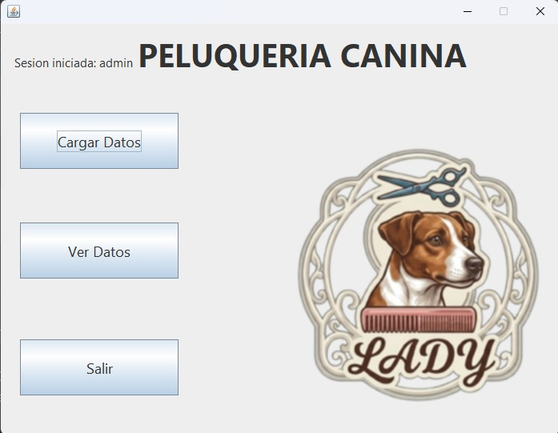
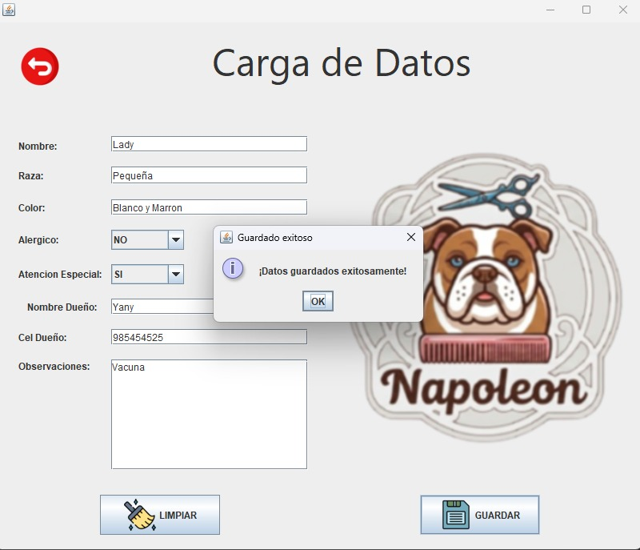
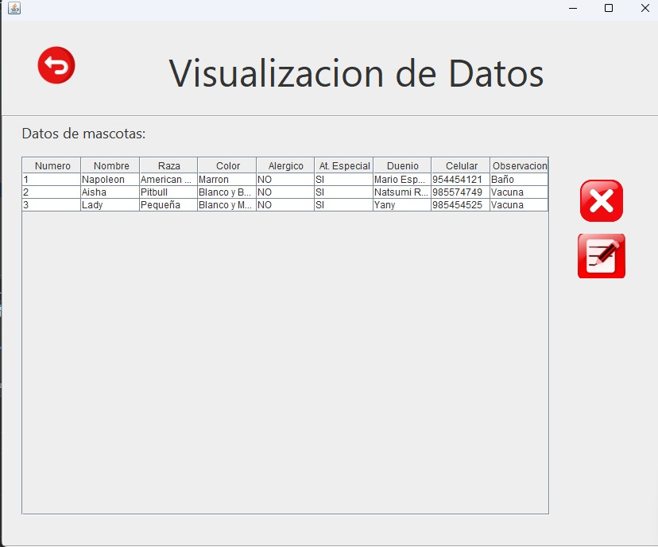
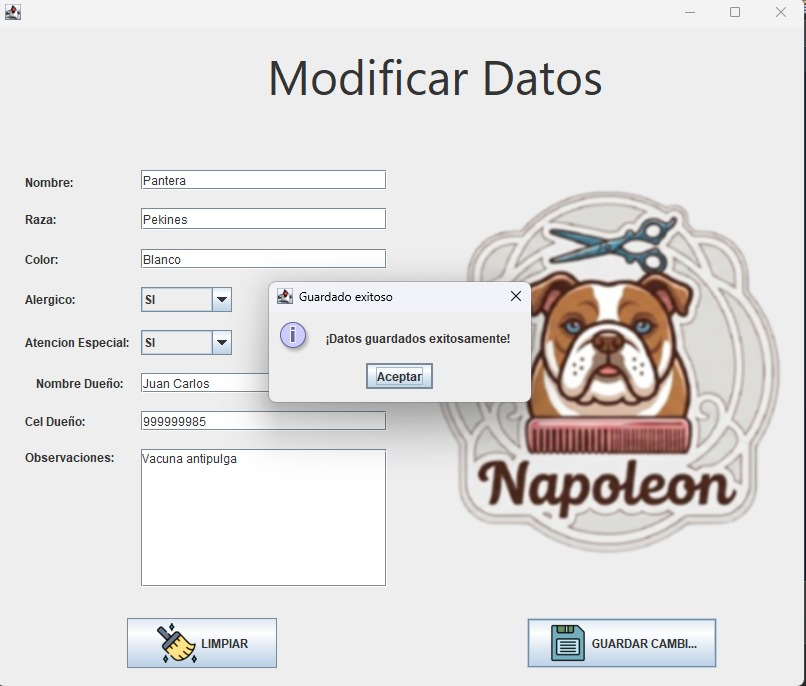

\# 🐶 Proyecto Peluquería Canina Lady’s

Aplicación de escritorio desarrollada en \*\*Java Swing + JPA + MySQL\*\* para la gestión de clientes y mascotas en una peluquería canina.  

El sistema implementa un CRUD completo con login, menú principal y operaciones de alta, baja, modificación y consulta.

\---

\## 📸 Capturas de Pantalla

\### 🔑 Login

\### 🏠 Pantalla Principal

\### ➕ Crear (Create)

\### 📖 Leer (Read)

\### ✏️ Actualizar (Update)

\---

\## 🎬 Demostración en Video

\[Ver video del proyecto](assets/proyecto\_peluqueria\_canina1.mp4)

\---

\## 🛠️ Tecnologías Utilizadas

\- Java 21 (Swing)

\- JPA / EclipseLink

\- MySQL 8.0

\- NetBeans IDE

\- Maven

\---

\## 👨‍💻 Autor

\*\*Mario Espejo\*\*  

Estudiante de Computación e Informática en Cibertec.  

Certificaciones: Java para Principiantes, Introducción a la Algoritmia.

\---

\## 📂 Estructura del Proyecto

